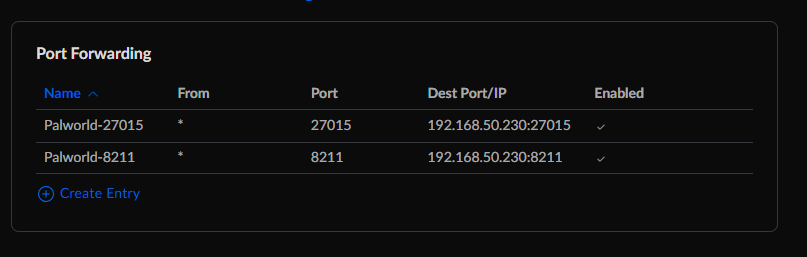

# Palworld Dedicated Server

Based on: https://github.com/thijsvanloef/palworld-server-docker

Helm Chart from: https://github.com/Twinki14/palworld-server-chart


## Setup

Create a file called `palworld_secrets.json` with the following content:

```json
{
	"server_password": "<password_here>",
	"discord_webhook_url": "<webhook_here>"
}
```

The path for this file will be used in `main.tf` `local.palworld_secrets_dir` variable.

Add in your password and webhook. Leave blank if you don't want to set them. DO NOT push this file to repo.

## Port-forwarding

Need port `8211` and `27015` port-forwarded after getting the Service External IP from MetalLB

Example below (Using Ubiquity Dream Router)



