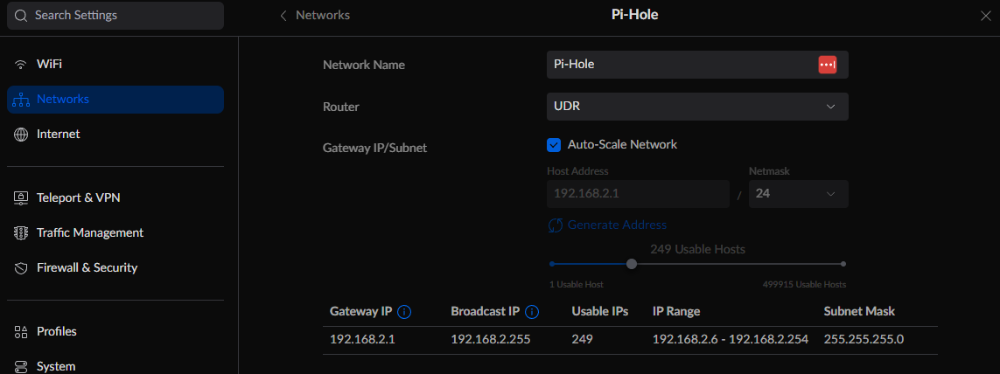
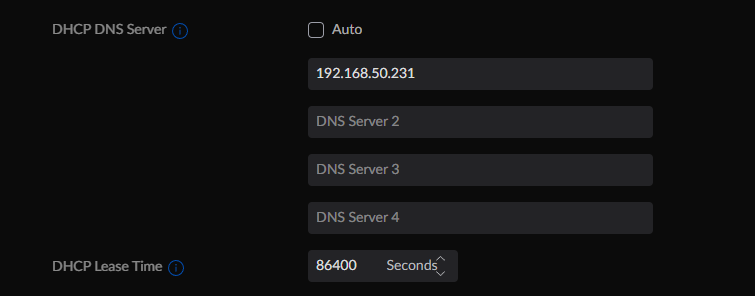
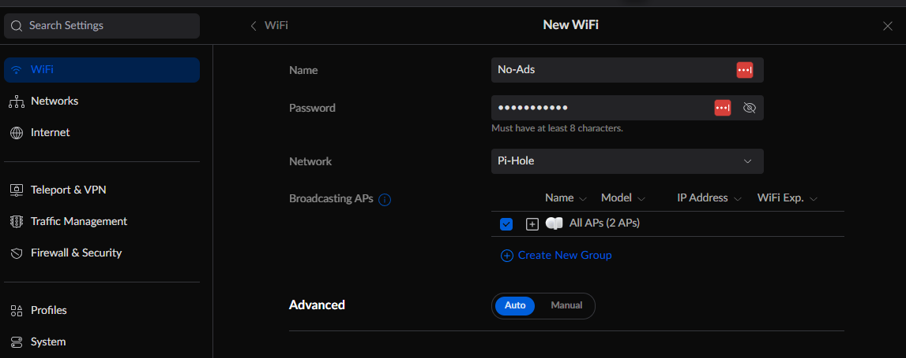
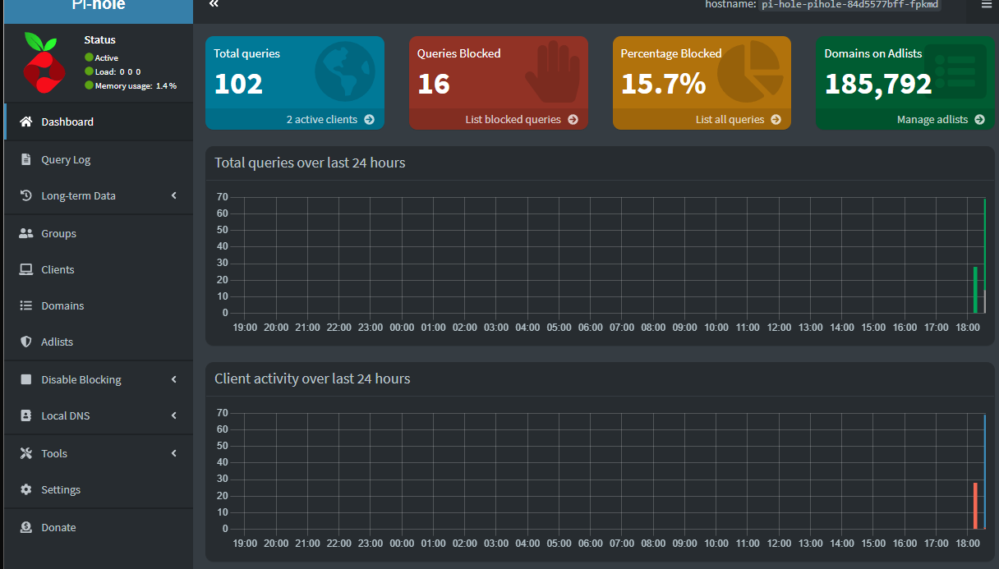

# Pi-hole

Based on: https://pi-hole.net

Helm Chart from: https://github.com/MoJo2600/pihole-kubernetes

## Setup

Deploy pi-hole using Terraform. Specify the External IP Address.

## Create Separate Wifi for Pi-Hole

Create a new VLAN in UDR (Settings > Networks > Create New) and use the pi-hole external IP Address as the DHCP DNS Server

Create new Wifi using the new VLAN

Go to the pi-hole admin console on the web browser (http://<pi-hole-ip>/admin). Connect to that Wifi on your phone. Navigate to a random website/youtube on your phone. You should see stats going up in pi-hole if ad blocking is working.

